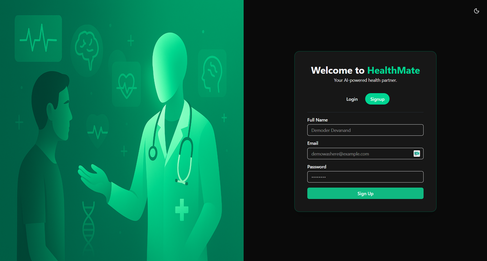
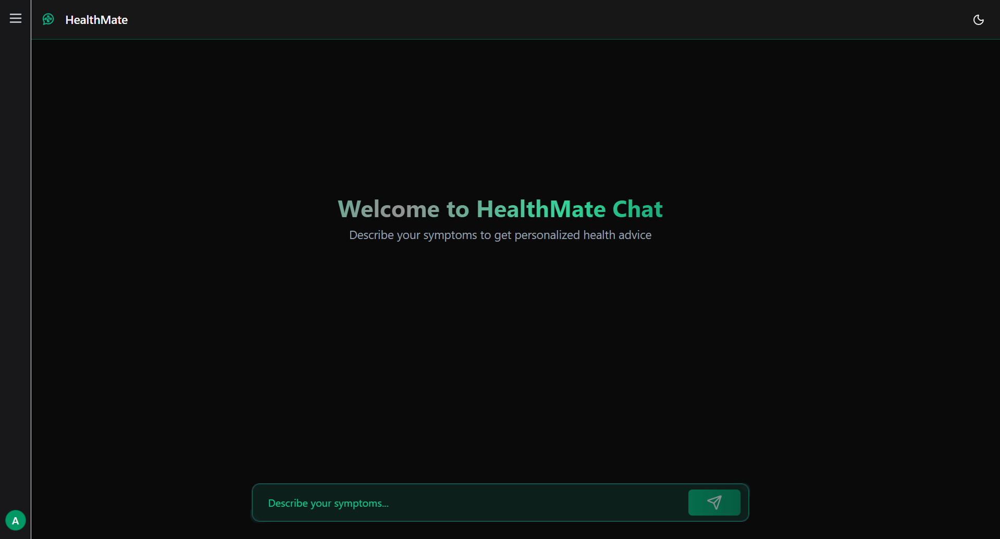
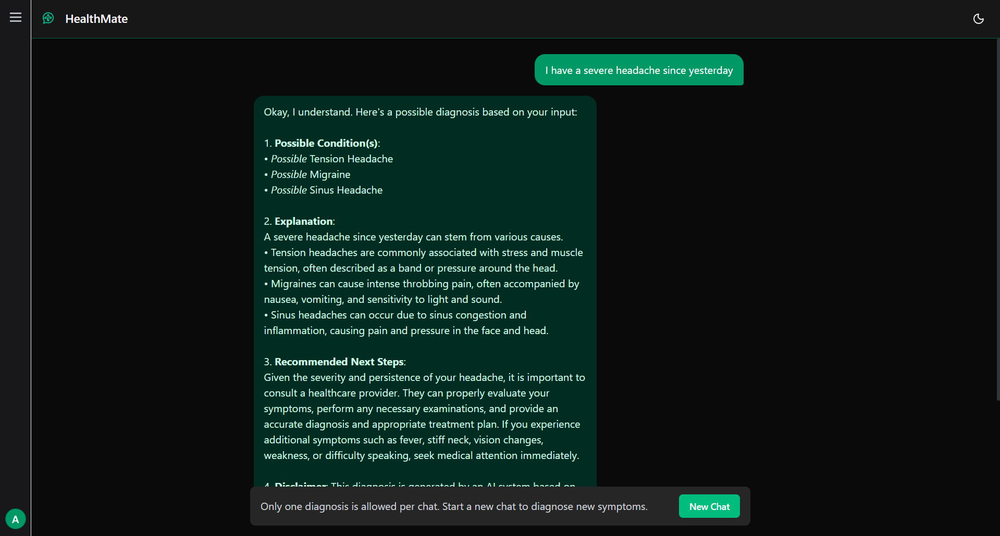
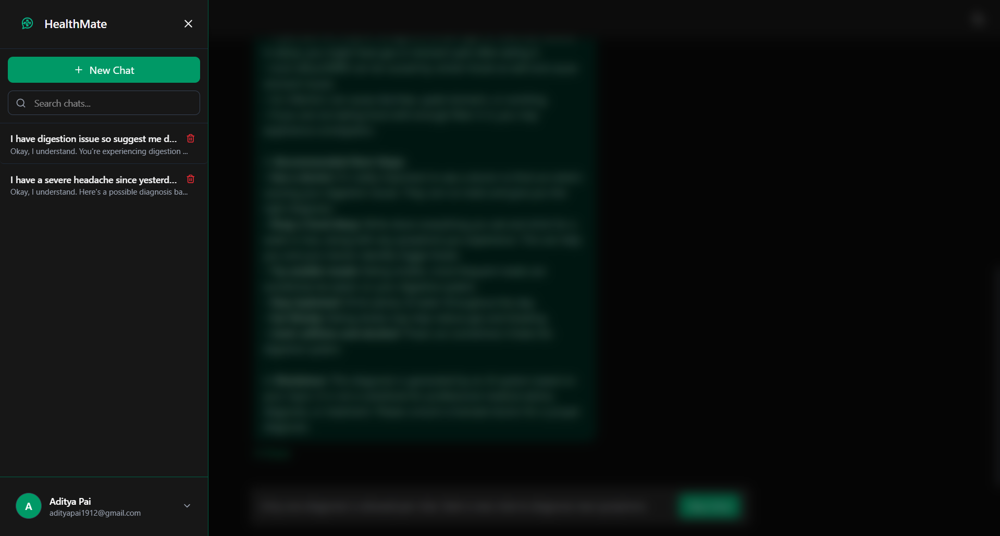

# 💊 HealthMate – AI-Powered Medical Diagnosis System

HealthMate is a full-stack web application that empowers users to **enter symptoms and receive AI-generated medical insights**.
It combines **secure authentication**, **diagnosis history tracking**, and **one-click sharing**, wrapped in a clean **emerald-themed UI** aligned with healthcare branding.

---

## ✨ Features

* 🔐 **Secure Authentication** – Signup/Login with JWT-based authentication
* 🤖 **AI Diagnosis** – Symptom analysis powered by **Gemini Gen AI**
* 📜 **History Tracking** – Stores and displays user diagnosis history
* 📤 **One-Click Sharing** – Share symptoms + diagnosis via **native share API** (with clipboard fallback)
* 🎨 **Modern ChatBot UI** – Emerald-branded responsive design built with **TailwindCSS** & **ShadCN**

---

## 🛠️ Tech Stack

* **Frontend**: React (TypeScript), TailwindCSS
* **Backend**: Java Spring Boot (JWT Auth, Email)
* **Database**: MongoDB
* **AI Integration**: Gemini Gen AI

---

## 📂 Project Structure

```
/client   → React frontend  
/server   → Spring Boot backend (includes its own README with setup + API guide)
```

* The **backend (`/server`)** has its own `README.md` with setup instructions and API documentation.
* The **frontend (`/client`)** can be set up directly using standard React steps (`npm install`, `npm run dev`), so no separate README is included.


---

## 🚀 Getting Started

### 1. Clone the repository

```bash
git clone https://github.com/adityapai05/healthmate.git
cd healthmate
```

### 2. Run the frontend

```bash
cd client
npm install
npm run dev
```

### 3. Run the backend

```bash
cd ../server
./mvnw spring-boot:run
# or
mvn spring-boot:run
```

---

## 📸 Screenshots

**Auth Page (Register/Login)**


   Secure authentication with user registration and login.

**Chat Page (Empty State)**


Clean chat interface with hero text and input box before entering symptoms.

**Chat Page (Diagnosis Generated)**


   AI-powered diagnosis generated from entered symptoms. Each chat corresponds to a single diagnosis. Option to start a new chat is available.

**Chat Page with Sidebar Open**


Sidebar containing logo, chat history, and account details with a collapsible design.”

---

## 📌 Notes

* HealthMate is **not a replacement for medical professionals**. It is intended as a **supportive health assistant**.


---
